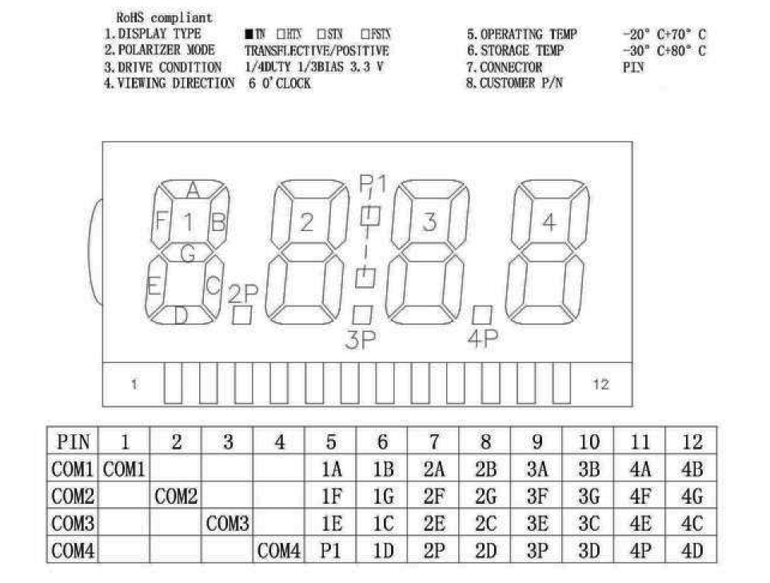
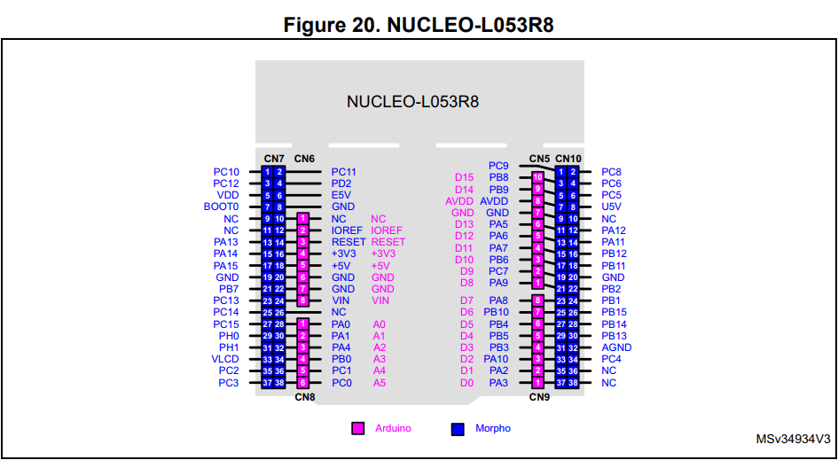

# README

### 1、软件配置

本例程所使用的是4COM-8SEG段式LCD液晶屏，引脚排布如下图所示：

使用ST官方出品的STM32CubeMX软件进行配置，选择NUCLEO64-STM32L053板子，勾选LCD1/4Duty和1/3blas，选择段引脚18～25，即PC0～PC7。在LCD详细配置中，修改LCD对比度为5级，即驱动电压3.29V。闪烁频率为f/1024，默认不开启闪烁。

在STM32CubeMX软件中打开ADC功能，配置ADC通道0作为采样输入。开启DMA功能，配置DMA数据宽度为WORD，DMA模式为Circular，开启DMA中断，不开启ADC中断。最后使用STM32CubeMX生成工程代码（手动勾选生成初始化代码）。

### 2、硬件配置

NUCLEO-L053板载接口如下图所示：

这里将PC0～PC7连接至LCD的5～12脚，LCD的1～4脚分别连接PA8，PA9，PA10，PB9。ADC采样连接PA0。